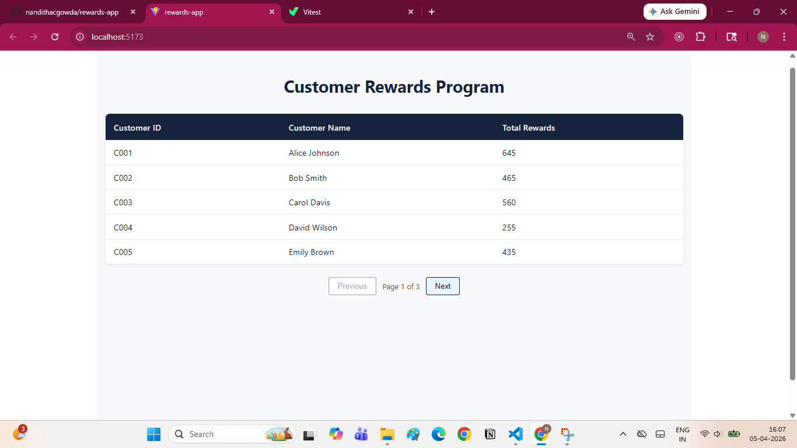
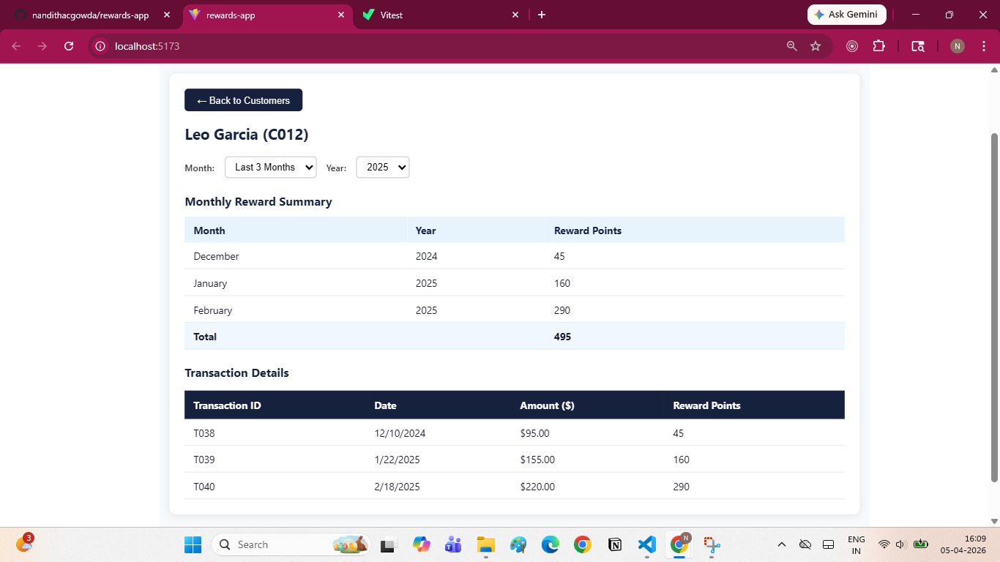
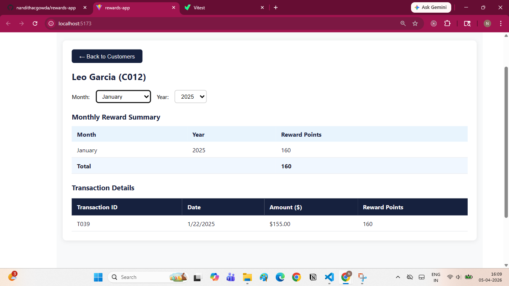
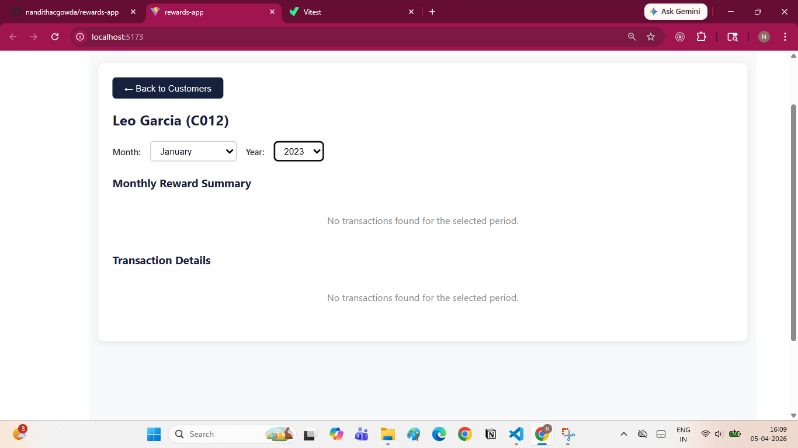
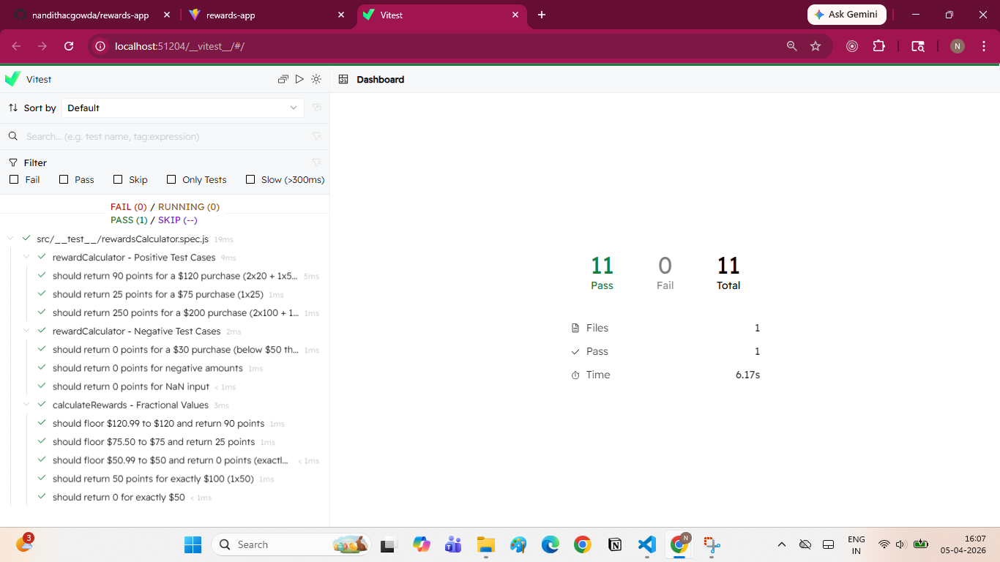

# Rewards Program App

## Overview
This project is a simple React application that calculates reward points for customers based on their transactions.

The reward logic is:
* 2 points for every dollar spent above $100
* 1 point for every dollar spent between $50 and $100

Example:

* For a transaction of $120
  → (20 × 2) + (50 × 1) = 90 points

---

## Tech Stack

* React JS (functional components)
* JavaScript
* Styled Components
* Local JSON data
* Jest for testing
* Pino for logging

---

## How to Run the Project

1. Clone the repository

```bash
git clone https://github.com/your-username/rewards-app.git
cd rewards-app
```

2. Install dependencies

```bash
npm install
```

3. Start the app

```bash
npm run dev
```

The app will run on `http://localhost:5173/`

---

## Features

* Displays list of customers
* Pagination for customer list
* Select a customer to view details
* Shows reward points per month
* Shows total reward points
* Month and year filter available
* Default view shows last 3 months data
* Shows "No transactions" if data is not available
* Simulated API call using local JSON
* Loading and error handling
* Logging using pino

---

## Project Structure

```
src/
  components/
  services/
  utils/
  constants/
  logger.js
  App.js

public/
  data/
    transactions.json
```

---

## Reward Calculation

The reward calculation is handled in a utility function.

* Handles invalid values like negative numbers or non-numeric input
* Works for both whole numbers and decimal values

---

## Testing

Unit tests are added for reward calculation logic.

Includes:

* Positive test cases
* Negative test cases
* Edge cases (like 50, 100, decimal values)

Run tests using:

```bash
npm test
```

---

## Logging

Logging is implemented using pino.

Logs are added for:

* API calls
* Errors
* User actions (like selecting a customer)

---

## Notes

* No Redux is used
* Data is fetched from a local JSON file (simulated API)
* No hardcoded data inside components
* Used props/state for data flow
* Styled components used for UI

---

## Screenshots

### Customer List

### Customer Details

### Filter Applied

### No Transactions

### Test Results


---

## Repository

https://github.com/your-username/rewards-app

---
